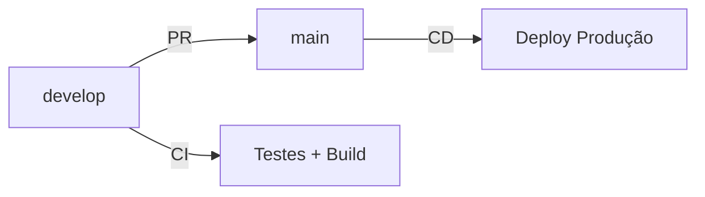

# 🔄 Estratégia de CI/CD - Fluxo de Branches

## 📊 Visão Geral



## 🔧 CI - Continuous Integration (`develop` branch)

**Arquivo**: `.github/workflows/ci.yml`
**Triggers**:

-   Push para `develop`
-   Pull Request para `main`

**Jobs executados**:

-   ✅ **Testes**: unit, integration, coverage
-   ✅ **Lint**: black, isort, flake8, mypy
-   ✅ **Docker Build**: Valida se compila (sem push)
-   ✅ **Security**: Bandit, dependency check
-   ✅ **Quality Gate**: SonarQube análise

**Resultado**: Valida se o código está pronto para produção

## 🚀 CD - Continuous Deployment (`main` branch)

**Arquivo**: `.github/workflows/infra_build_deploy.yml`
**Triggers**:

-   Push para `main` (após merge da PR)

**Jobs executados**:

-   🏗️ **Infraestrutura**: Terraform provisiona EC2
-   🐳 **Build & Push**: Docker image para Docker Hub
-   🚀 **Deploy**: Container na EC2 em produção

**Resultado**: Aplicação em produção

## 📋 Fluxo Recomendado

### 1. Desenvolvimento (`develop`)

```bash
git checkout develop
git pull origin develop
# ... fazer alterações ...
git add .
git commit -m "feat: nova funcionalidade"
git push origin develop
```

**→ Executa CI automaticamente**

### 2. Pull Request para Produção

```bash
# No GitHub: criar PR de develop → main
```

**→ CI executa novamente para validar**

### 3. Merge para Produção (`main`)

```bash
# No GitHub: merge da PR
```

**→ CD executa automaticamente (deploy)**

## ⚙️ Configuração por Branch

### Branch `develop` - Foco em Qualidade

-   **Objetivo**: Validar código
-   **Executa**: Testes, lint, build
-   **NÃO executa**: Deploy, push Docker Hub
-   **Secrets necessárias**: Nenhuma

### Branch `main` - Foco em Deploy

-   **Objetivo**: Colocar em produção
-   **Executa**: Infra + Build + Deploy
-   **Secrets necessárias**: AWS, Docker Hub, SSH

## 🔐 Secrets por Workflow

### CI (develop) - ✅ Nenhuma secret necessária

-   Apenas validações locais

### CD (main) - 🔑 7 secrets necessárias

-   `AWS_ACCESS_KEY_ID`
-   `AWS_SECRET_ACCESS_KEY`
-   `DOCKERHUB_USERNAME`
-   `DOCKERHUB_TOKEN`
-   `EC2_USER`
-   `EC2_SSH_KEY`
-   `MY_IP`

## 🎯 Benefícios desta Estratégia

1. **Segurança**: Deploy apenas após validação completa
2. **Velocidade**: CI rápido sem deploy desnecessário
3. **Qualidade**: Múltiplas verificações antes de produção
4. **Isolamento**: Develop para testes, main para produção
5. **Rastreabilidade**: Deploy apenas em commits específicos

## 🚦 Status da Implementação

-   ✅ CI configurado para `develop`
-   ✅ CD configurado para `main`
-   ✅ Docker build validado
-   ✅ Testes passando (438/438)
-   ⏳ Aguardando configuração de secrets para CD
