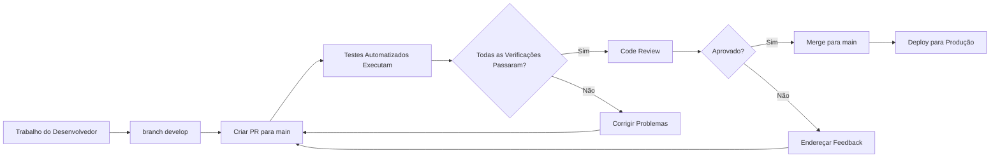

## Fase 4 Tech Challenge

---

Primeiro esboço de estrutura

```bash
acompanhamento/
├── app
│   ├── api
│   │   ├── dependencies.py
│   │   ├── __init__.py
│   │   └── v1
│   │       ├── acompanhamento.py
│   │       └── __init__.py
│   ├── core
│   │   ├── config.py
│   │   ├── __init__.py
│   │   └── kafka.py
│   ├── db
│   │   ├── base.py
│   │   └── __init__.py
│   ├── domain
│   │   ├── acompanhamento_service.py
│   │   ├── __init__.py
│   │   └── order_state.py
│   ├── __init__.py
│   ├── main.py
│   ├── models
│   │   ├── acompanhamento.py
│   │   ├── events.py
│   │   └── __init__.py
│   └── repository
│       ├── acompanhamento_repository.py
│       └── __init__.py
├── Dockerfile
├── README.md
└── tests
    ├── __init__.py
    └── test_acompanhamento.py

10 directories, 23 files
```

## 🚀 Pipeline CI/CD

Este projeto inclui um pipeline CI/CD abrangente usando GitHub Actions com múltiplos workflows:

### 📋 Workflows Disponíveis

#### 1. **Pipeline Principal CI/CD** (`.github/workflows/ci.yml`)

-   **Gatilhos**: Push para `main`/`develop`, Pull Requests
-   **Funcionalidades**:
    -   ✅ Testes em múltiplas versões do Python (3.11, 3.12)
    -   ✅ Cache de dependências com Poetry
    -   ✅ Suite de testes abrangente (unit, integration, performance, e2e)
    -   ✅ Relatório de cobertura de código
    -   ✅ Escaneamento de segurança
    -   ✅ Build da imagem Docker
    -   ✅ Validação de quality gate

#### 2. **Workflow de Testes** (`.github/workflows/test.yml`)

-   **Gatilhos**: Eventos de push e PR
-   **Funcionalidades**:
    -   ✅ Execução organizada de testes por categoria
    -   ✅ Validação do test runner customizado
    -   ✅ Verificações de qualidade de código (black, ruff, mypy)
    -   ✅ Artefatos de relatórios de cobertura

#### 3. **Verificação de Pull Request** (`.github/workflows/pr-check.yml`)

-   **Gatilhos**: Apenas Pull Requests
-   **Funcionalidades**:
    -   ✅ Testes de validação rápidos
    -   ✅ Validação de regras de negócio
    -   ✅ Teste de importação de models
    -   ✅ Relatórios de resumo do PR

#### 4. **Deploy** (`.github/workflows/deploy.yml`)

-   **Gatilhos**: Push para `main`, dispatch manual
-   **Funcionalidades**:
    -   ✅ Proteção do ambiente de produção
    -   ✅ Suite completa de testes antes do deploy
    -   ✅ Build e teste da imagem Docker
    -   ✅ Escaneamento de vulnerabilidades de segurança

#### 5. **Badge de Cobertura** (`.github/workflows/badge.yml`)

-   **Gatilhos**: Eventos de push e PR
-   **Funcionalidades**:
    -   ✅ Geração automática de badge de cobertura
    -   ✅ Atualizações de badge no README

### 🧪 Categorias de Testes

Nossa suite de testes está organizada em categorias que executam automaticamente:

```bash
# Unit Tests (rápidos, isolados)
tests/unit/models/          # Testes de validação de models
tests/unit/schemas/         # Testes de validação de schemas

# Integration Tests (interação entre componentes)
tests/integration/          # Testes de consistência de models

# Performance Tests (carga e velocidade)
tests/performance/          # Benchmarks de performance dos models

# End-to-End Tests (fluxo completo)
tests/e2e/                  # Cenários completos de negócio
```

### 📊 Métricas de Qualidade

-   **Cobertura de Testes**: 90%+ mantida automaticamente
-   **Validação de Regras de Negócio**: ✅ Aplicada
-   **Suporte Multi-Python**: 3.11, 3.12
-   **Escaneamento de Segurança**: Scanner de vulnerabilidades Trivy
-   **Qualidade de Código**: Verificações opcionais de linting e formatação

### 🔧 Executando Testes Localmente

```bash
# Usando nosso test runner customizado
python run_tests.py unit           # Apenas unit tests
python run_tests.py integration    # Apenas integration tests
python run_tests.py performance    # Apenas performance tests
python run_tests.py e2e            # Apenas end-to-end tests
python run_tests.py all            # Todos os testes
python run_tests.py coverage       # Todos os testes com cobertura

# Usando pytest diretamente
poetry run pytest tests/unit/                    # Unit tests
poetry run pytest tests/ --cov=app/models        # Com cobertura
poetry run pytest -m performance                 # Apenas performance tests
```

### 🏷️ Status Badges


### 🛡️ Segurança e Qualidade

-   **Escaneamento Automático de Segurança**: Scanner de vulnerabilidades Trivy
-   **Segurança de Dependências**: Verificações Safety para vulnerabilidades conhecidas
-   **Qualidade de Código**: Linting opcional com ruff e formatação com black
-   **Verificação de Tipos**: Type checking opcional com mypy
-   **Quality Gates**: Previnem merge se os testes falharem

### 🚀 Processo de Deploy

1. **Desenvolvimento**: Trabalhar na branch `develop`
2. **Pull Request**: Validação automática do PR executada
3. **Code Review**: Processo de revisão manual
4. **Merge para Main**: Aciona o pipeline CI/CD completo
5. **Deploy**: Imagem Docker construída e pronta para produção

O pipeline garante alta qualidade de código e previne regressões através de testes automatizados abrangentes.

## 🛡️ Configuração de Proteção de Branch

Para proteger adequadamente a branch `main` e aplicar o pipeline CI/CD, configure as seguintes regras de proteção de branch no GitHub:

### 📋 Configuração de Proteção de Branch no GitHub

1. **Vá para Configurações do Repositório** → **Branches**
2. **Adicione Regra** para a branch `main`
3. **Configure as seguintes configurações**:

#### ✅ **Configurações Obrigatórias:**

-   ☑️ **Exigir pull request antes do merge**

    -   ☑️ Exigir aprovações: `1` (ou mais)
    -   ☑️ Descartar aprovações de PR obsoletas quando novos commits são enviados
    -   ☑️ Exigir revisão de code owners (se você tiver arquivo CODEOWNERS)

-   ☑️ **Exigir que verificações de status passem antes do merge**

    -   ☑️ Exigir que branches estejam atualizadas antes do merge
    -   **Verificações de status obrigatórias** (adicione estes nomes exatos):
        -   `required-checks` (do main-branch-protection.yml)
        -   `test (3.11)` (do ci.yml)
        -   `test (3.12)` (do ci.yml)
        -   `validate-pr` (do pr-check.yml)

-   ☑️ **Exigir resolução de conversas antes do merge**
-   ☑️ **Exigir commits assinados** (recomendado)
-   ☑️ **Exigir histórico linear** (recomendado)
-   ☑️ **Não permitir contornar as configurações acima**

#### 🔒 **Configurações Administrativas:**

-   ☑️ **Restringir pushes que criam arquivos** (opcional)
-   ☑️ **Restringir pushes que deletam arquivos** (opcional)
-   ❌ **Permitir force pushes** (manter desabilitado)
-   ❌ **Permitir deleções** (manter desabilitado)

### 🔄 **Fluxo de Trabalho Recomendado:**



### 🧪 **Verificações Obrigatórias para Branch Main:**

Seu pipeline CI/CD aplica estes requisitos para qualquer PR para main:

1. **✅ Unit Tests** - Todos os testes de model e schema devem passar
2. **✅ Integration Tests** - Testes de interação entre componentes devem passar
3. **✅ Performance Tests** - Benchmarks de performance devem passar
4. **✅ E2E Tests** - Testes de fluxo end-to-end devem passar
5. **✅ Verificação de Cobertura** - Cobertura mínima de 90% exigida
6. **✅ Regras de Negócio** - Todas as regras de validação Pydantic devem funcionar corretamente

### 🚫 **O que é Bloqueado:**

-   ❌ **Pushes diretos para main** - Todas as mudanças devem passar por PR
-   ❌ **Merge sem testes** - Todas as verificações obrigatórias devem passar
-   ❌ **Merge com baixa cobertura** - Cobertura mínima de 90% aplicada
-   ❌ **Merge com regras de negócio quebradas** - Regras de validação devem funcionar
-   ❌ **Force pushes** - Histórico não pode ser reescrito
-   ❌ **Mudanças não revisadas** - Pelo menos 1 aprovação necessária

### 🎯 **Benefícios desta Configuração:**

-   **Garantia de Qualidade**: Apenas código testado e revisado chega ao main
-   **Proteção de Regras de Negócio**: Validações críticas não podem ser quebradas
-   **Segurança de Deploy**: Branch main está sempre deployável
-   **Colaboração em Equipe**: Força processo de code review
-   **Trilha de Auditoria**: Todas as mudanças rastreadas através de PRs
-   **Segurança de Rollback**: Histórico linear facilita rollbacks

### 🚀 **Guia Rápido para Novos Contribuidores:**

```bash
# 1. Criar feature branch a partir do develop
git checkout develop
git pull origin develop
git checkout -b feature/nome-da-sua-feature

# 2. Fazer suas mudanças e testar localmente
python run_tests.py all

# 3. Commit e push
git add .
git commit -m "feat: descrição da sua feature"
git push origin feature/nome-da-sua-feature

# 4. Criar PR para main via interface do GitHub
# 5. Aguardar testes automatizados e revisão
# 6. Fazer merge após aprovação e todas as verificações passarem
```

Esta configuração garante que sua branch main esteja sempre estável e deployável! 🛡️
