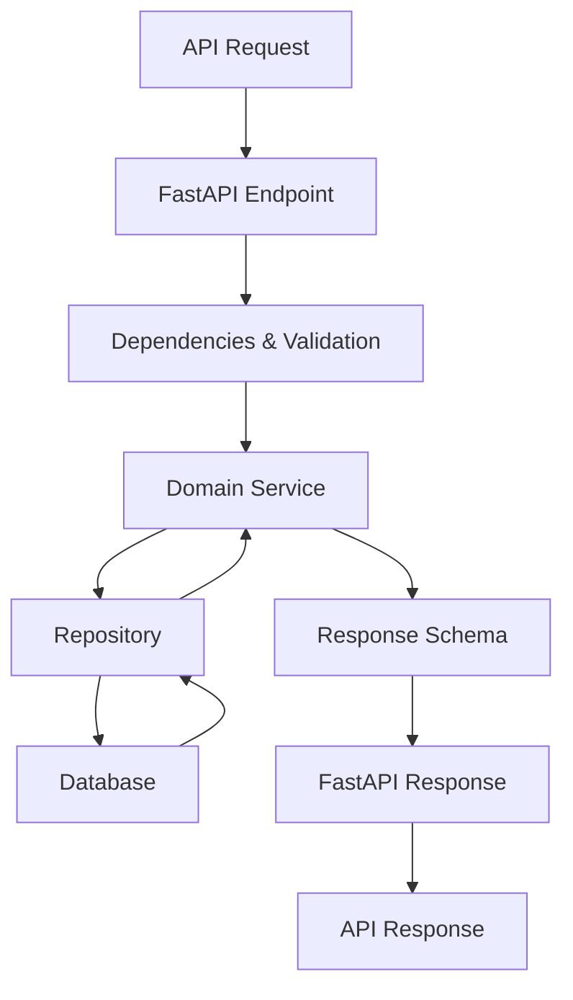

# 🏗️ Arquitetura do Projeto

## 📁 Estrutura do Projeto

```bash
acompanhamento/
├── app/                          # Código fonte principal
│   ├── api/                      # Camada de API (FastAPI)
│   │   ├── dependencies.py       # Dependências e validações
│   │   └── v1/                   # Versão da API
│   │       └── acompanhamento.py # Endpoints do microserviço
│   ├── core/                     # Configurações centrais
│   │   ├── config.py             # Configurações da aplicação
│   │   └── kafka.py              # Configurações do Kafka
│   ├── db/                       # Camada de banco de dados
│   │   ├── base.py               # Configurações base do DB
│   │   └── session.py            # Gerenciamento de sessões
│   ├── domain/                   # Regras de negócio
│   │   ├── acompanhamento_service.py # Serviços de negócio
│   │   └── order_state.py        # Gerenciamento de estados
│   ├── models/                   # Modelos de dados (Pydantic)
│   │   ├── acompanhamento.py     # Modelos principais
│   │   └── events.py             # Modelos de eventos
│   ├── repository/               # Camada de acesso a dados
│   │   └── acompanhamento_repository.py # Repository pattern
│   ├── schemas/                  # Schemas da API (Request/Response)
│   │   └── acompanhamento_schemas.py # Schemas FastAPI
│   └── main.py                   # Ponto de entrada da aplicação
├── tests/                        # Suite de testes
│   ├── unit/                     # Testes unitários
│   │   ├── api/                  # Testes da API
│   │   ├── models/               # Testes dos models
│   │   ├── repository/           # Testes do repository
│   │   ├── schemas/              # Testes dos schemas
│   │   └── service/              # Testes dos serviços
│   ├── integration/              # Testes de integração
│   ├── performance/              # Testes de performance
│   └── e2e/                      # Testes end-to-end
├── documentation/               # Documentação técnica do projeto
├── .github/workflows/            # Pipelines CI/CD
├── alembic/                      # Migrações do banco
├── docker-compose.yml            # Orquestração local
├── Dockerfile                    # Container da aplicação
├── pyproject.toml               # Dependências e configurações
└── run_tests.py                 # Test runner customizado
```

## 🎯 Camadas da Arquitetura

### 1. **API Layer** (`app/api/`)

-   **Responsabilidade**: Interface externa, validação de entrada, serialização
-   **Tecnologia**: FastAPI
-   **Componentes**: Endpoints, Dependencies, Middlewares

### 2. **Domain Layer** (`app/domain/`)

-   **Responsabilidade**: Regras de negócio, lógica de aplicação
-   **Tecnologia**: Python puro
-   **Componentes**: Services, Business Rules, State Management

### 3. **Repository Layer** (`app/repository/`)

-   **Responsabilidade**: Acesso a dados, persistência
-   **Tecnologia**: SQLAlchemy (preparado)
-   **Componentes**: Repository Pattern, Data Access Objects

### 4. **Models Layer** (`app/models/`)

-   **Responsabilidade**: Definição de entidades e estruturas de dados
-   **Tecnologia**: Pydantic
-   **Componentes**: Domain Models, Value Objects, Events

### 5. **Core Layer** (`app/core/`)

-   **Responsabilidade**: Configurações, utilitários centrais
-   **Tecnologia**: Pydantic Settings
-   **Componentes**: Config, Kafka Setup, Database Config

## 🔄 Fluxo de Dados



## 📋 Modelos de Dados

### Principais Entidades:

1. **ItemPedido**

    - `id_produto: int`
    - `quantidade: int`
    - Validações de negócio integradas

2. **EventoPedido**

    - `id_pedido: int`
    - `cpf_cliente: str`
    - `status_pedido: StatusPedido`
    - `itens: List[ItemPedido]`
    - `total_pedido: float`
    - `data_pedido: datetime`
    - `tempo_estimado: Optional[str]`

3. **EventoPagamento**

    - `id_pedido: int`
    - `status_pagamento: StatusPagamento`
    - `valor_pago: float`
    - `data_pagamento: datetime`

4. **Acompanhamento**
    - União de dados de pedido e pagamento
    - Estado consolidado do pedido
    - Informações de tracking

### Enums de Status:

-   **StatusPedido**: `Recebido`, `Em Preparação`, `Pronto`, `Finalizado`
-   **StatusPagamento**: `Pendente`, `Pago`, `Falhou`

## 🔧 Configurações

### Ambientes Suportados:

-   **Development**: Configurações para desenvolvimento local
-   **Test**: Configurações para execução de testes
-   **Production**: Configurações para ambiente produtivo

### Variáveis de Ambiente:

-   `DATABASE_URL`: URL de conexão com banco
-   `KAFKA_BOOTSTRAP_SERVERS`: Servidores Kafka
-   `LOG_LEVEL`: Nível de logging
-   `ENVIRONMENT`: Ambiente atual (dev/test/prod)

## 🚀 Tecnologias Utilizadas

-   **FastAPI**: Framework web assíncrono
-   **Pydantic**: Validação de dados e serialização
-   **SQLAlchemy**: ORM para banco de dados (preparado)
-   **Alembic**: Migrações de banco
-   **Kafka**: Mensageria assíncrona (preparado)
-   **Poetry**: Gerenciamento de dependências
-   **Docker**: Containerização
-   **Pytest**: Framework de testes
-   **GitHub Actions**: CI/CD
