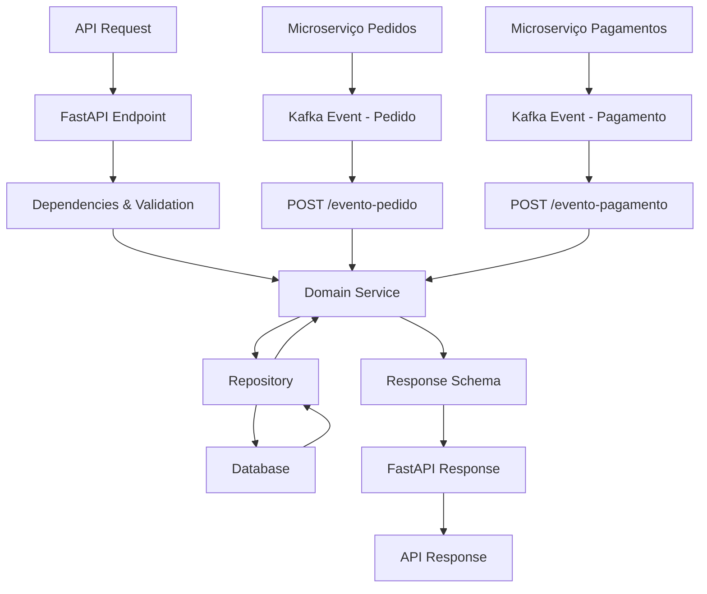

# 🏗️ Arquitetura do Projeto

## 📁 Estrutura do Projeto

```bash
acompanhamento/
├── app/                          # Código fonte principal
│   ├── api/                      # Camada de API (FastAPI)
│   │   ├── dependencies.py       # Dependências e validações
│   │   └── v1/                   # Versão da API
│   │       └── acompanhamento.py # Endpoints do microserviço
│   ├── core/                     # Configurações centrais
│   │   ├── config.py             # Configurações da aplicação
│   │   ├── exceptions.py         # Exceções customizadas
│   │   └── kafka.py              # Configurações do Kafka
│   ├── db/                       # Camada de banco de dados
│   │   ├── base.py               # Configurações base do DB
│   │   └── session.py            # Gerenciamento de sessões
│   ├── domain/                   # Regras de negócio
│   │   ├── acompanhamento_service.py # Serviços de negócio
│   │   └── order_state.py        # Gerenciamento de estados
│   ├── models/                   # Modelos de dados (Pydantic)
│   │   ├── acompanhamento.py     # Modelos principais
│   │   └── events.py             # Modelos de eventos
│   ├── repository/               # Camada de acesso a dados
│   │   └── acompanhamento_repository.py # Repository pattern
│   ├── schemas/                  # Schemas da API (Request/Response)
│   │   └── acompanhamento_schemas.py # Schemas FastAPI
│   └── main.py                   # Ponto de entrada da aplicação
├── tests/                        # Suite de testes
│   ├── unit/                     # Testes unitários
│   │   ├── api/                  # Testes da API
│   │   ├── models/               # Testes dos models
│   │   ├── repository/           # Testes do repository
│   │   ├── schemas/              # Testes dos schemas
│   │   └── service/              # Testes dos serviços
│   ├── integration/              # Testes de integração
│   ├── performance/              # Testes de performance
│   └── e2e/                      # Testes end-to-end
├── documentation/               # Documentação técnica do projeto
├── .github/workflows/            # Pipelines CI/CD
├── alembic/                      # Migrações do banco
├── docker-compose.yml            # Orquestração local
├── Dockerfile                    # Container da aplicação
├── pyproject.toml               # Dependências e configurações
└── run_tests.py                 # Test runner customizado
```

## 🎯 Camadas da Arquitetura

### 1. **API Layer** (`app/api/`)

-   **Responsabilidade**: Interface externa, validação de entrada, serialização
-   **Tecnologia**: FastAPI
-   **Componentes**: Endpoints, Dependencies, Middlewares

### 2. **Domain Layer** (`app/domain/`)

-   **Responsabilidade**: Regras de negócio, lógica de aplicação
-   **Tecnologia**: Python puro
-   **Componentes**: Services, Business Rules, State Management

### 3. **Repository Layer** (`app/repository/`) ✅ IMPLEMENTADO

-   **Responsabilidade**: Acesso a dados, persistência
-   **Tecnologia**: SQLAlchemy 2.0 com async/await ✅ NOVO
-   **Componentes**: Repository Pattern, Data Access Objects
-   **Implementação**:
    -   CRUD completo (Create, Read, Update, Delete)
    -   Eager loading com selectinload para evitar lazy loading
    -   Async sessions para performance
    -   Conversão automática entre modelos de banco e domínio
    -   Tratamento de constraints e integridade referencial

### 4. **Models Layer** (`app/models/`)

-   **Responsabilidade**: Definição de entidades e estruturas de dados
-   **Tecnologia**: Pydantic
-   **Componentes**: Domain Models, Value Objects, Events

### 5. **Core Layer** (`app/core/`)

-   **Responsabilidade**: Configurações, utilitários centrais, exceções customizadas
-   **Tecnologia**: Pydantic Settings
-   **Componentes**: Config, Kafka Setup, Database Config, Custom Exceptions

## 🔄 Fluxo de Dados


```mermaid
graph TB
    A[API Request] --> B[FastAPI Endpoint]
    B --> C[Dependencies & Validation]
    C --> D[Domain Service]
    D --> E[Repository]
    E --> F[Database]
    F --> E
    E --> D
    D --> G[Response Schema]
    G --> H[FastAPI Response]
    H --> I[API Response]

    %% Fluxo de Eventos Kafka ✅ NOVO
    J[Kafka Event - Pedido] --> K[POST /evento-pedido]
    K --> D
    L[Kafka Event - Pagamento] --> M[POST /evento-pagamento]
    M --> D

    %% Integração entre Microserviços ✅ NOVO
    N[Microserviço Pedidos] --> J
    O[Microserviço Pagamentos] --> L
```

### Processamento de Eventos ✅ NOVO

1. **Eventos de Pedido**: Microserviço de pedidos publica eventos que são processados via `/acompanhamento/evento-pedido`
2. **Eventos de Pagamento**: Microserviço de pagamentos publica eventos que são processados via `/acompanhamento/evento-pagamento`
3. **Consolidação**: Estados de pedido e pagamento são consolidados no acompanhamento
4. **Notificações**: Sistema pode notificar clientes sobre mudanças de status

## 📋 Modelos de Dados

### Principais Entidades:

1. **ItemPedido**

    - `id_produto: int`
    - `quantidade: int`
    - Validações de negócio integradas

2. **EventoPedido**

    - `id_pedido: int`
    - `cpf_cliente: str`
    - `status_pedido: StatusPedido`
    - `itens: List[ItemPedido]`
    - `total_pedido: float`
    - `data_pedido: datetime`
    - `tempo_estimado: Optional[str]`

3. **EventoPagamento**

    - `id_pedido: int`
    - `status_pagamento: StatusPagamento`
    - `valor_pago: float`
    - `data_pagamento: datetime`

4. **Acompanhamento**
    - União de dados de pedido e pagamento
    - Estado consolidado do pedido
    - Informações de tracking

### Enums de Status:

-   **StatusPedido**: `Recebido`, `Em Preparação`, `Pronto`, `Finalizado`
-   **StatusPagamento**: `Pendente`, `Pago`, `Falhou`

## � Endpoints da API

### Endpoints Implementados:

1. **Health Check**

    - `GET /` - Status básico da aplicação
    - `GET /health` - Health check detalhado com timestamp

2. **Acompanhamento de Pedidos**

    - `GET /acompanhamento/{id_pedido}` - Buscar pedido por ID
    - `PUT /acompanhamento/{id_pedido}/status` - Atualizar status do pedido
    - `GET /acompanhamento/fila/pedidos` - Listar fila de pedidos
    - `GET /acompanhamento/cliente/{cpf}` - Histórico do cliente

3. **Processamento de Eventos (Kafka Integration)** ✅ NOVO
    - `POST /acompanhamento/evento-pedido` - Processar eventos de criação/atualização de pedidos via Kafka
    - `POST /acompanhamento/evento-pagamento` - Processar eventos de pagamento via Kafka

### Padrões de Response:

-   **Sucesso**: Status 200 com dados estruturados
-   **Erro**: Status 4xx/5xx com detalhes do erro
-   **Validação**: Automática via Pydantic
-   **Documentação**: Swagger automático em `/docs`

## 🧪 Estratégia de Testes

### **Cobertura Total: 424 testes | 97% coverage** ✅ ATUALIZADO

### 1. **Testes Unitários** (`tests/unit/`)

-   **336 testes** distribuídos por camada ✅ ATUALIZADO
-   **API Layer**: 152 testes (endpoints, schemas, dependencies)
-   **Models Layer**: 66 testes (validação, serialização)
-   **Repository Layer**: 41 testes (CRUD operations, mocking) ✅ NOVO
-   **Service Layer**: 77 testes (business logic, calculations, error handling)

### 2. **Testes de Integração** (`tests/integration/`)

-   **46 testes** de integração entre componentes ✅ ATUALIZADO
-   **Database Integration**: 8 testes de integração com SQLAlchemy ✅ NOVO
-   **API Integration**: 14 testes funcionais de endpoints ✅ NOVO
-   **Model Consistency**: Validação entre diferentes models

### 3. **Testes de Performance** (`tests/performance/`)

-   **39 testes** de performance e throughput ✅ ATUALIZADO
-   **Memory Monitoring**: Usando psutil para controle de memória
-   **Concurrent Testing**: Simulação de carga e stress
-   **Response Time**: Benchmarks de latência

### 4. **Testes E2E** (`tests/e2e/`)

-   **3 testes** de workflow completo
-   **Order Lifecycle**: Fluxo completo do pedido
-   **Error Recovery**: Cenários de falha e recuperação

### Ferramentas de Teste:

-   **Test Runner**: `python run_tests.py` (customizado)
-   **Coverage**: pytest-cov com relatórios HTML (97% atual) ✅ ATUALIZADO
-   **Performance**: psutil para monitoring de memória
-   **Mocking**: AsyncMock para testes assíncronos
-   **Database Testing**: SQLite in-memory para testes de integração ✅ NOVO
-   **Functional Testing**: Abordagem funcional para endpoints API ✅ NOVO

## �🔧 Configurações

### Ambientes Suportados:

-   **Development**: Configurações para desenvolvimento local
-   **Test**: Configurações para execução de testes
-   **Production**: Configurações para ambiente produtivo

### Variáveis de Ambiente:

-   `DATABASE_URL`: URL de conexão com banco
-   `KAFKA_BOOTSTRAP_SERVERS`: Servidores Kafka
-   `LOG_LEVEL`: Nível de logging
-   `ENVIRONMENT`: Ambiente atual (dev/test/prod)

## 🚨 Tratamento de Exceções

### Exceções Customizadas (`app/core/exceptions.py`):

-   **AcompanhamentoException**: Base para exceções de negócio
-   **AcompanhamentoNotFound**: Pedido não encontrado
-   **InvalidStatusTransition**: Transição de status inválida
-   **ValidationError**: Erros de validação de dados

### Context Manager:

-   **handle_service_exceptions()**: Conversão automática para HTTP errors
-   **Logging**: Rastreamento automático de exceções
-   **User-Friendly**: Mensagens de erro padronizadas

## 🚀 Tecnologias Utilizadas

### **Core Framework:**

-   **FastAPI**: Framework web assíncrono com documentação automática
-   **Pydantic**: Validação de dados e serialização
-   **SQLAlchemy**: ORM async implementado para MySQL/SQLite ✅ IMPLEMENTADO
-   **Alembic**: Migrações de banco

### **Mensageria e Configuração:**

-   **Kafka**: Mensageria assíncrona (preparado)
-   **Poetry**: Gerenciamento de dependências
-   **Docker**: Containerização

### **Testes e Qualidade:**

-   **Pytest**: Framework de testes (424 testes implementados) ✅ ATUALIZADO
-   **pytest-cov**: Cobertura de código (97% atual) ✅ ATUALIZADO
-   **psutil**: Monitoring de performance e memória
-   **AsyncMock**: Testes assíncronos
-   **SQLite**: Database in-memory para testes de integração ✅ NOVO

### **DevOps e CI/CD:**

-   **GitHub Actions**: CI/CD pipeline
-   **Pre-commit**: Hooks de qualidade
-   **Custom Test Runner**: `run_tests.py` para execução organizada

### **Desenvolvimento:**

-   **VS Code**: Editor recomendado com configurações específicas
-   **Black**: Formatação de código
-   **isort**: Organização de imports
