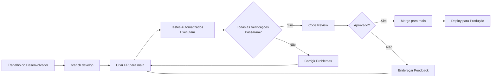

# 🛡️ Configuração de Proteção de Branch

Para proteger adequadamente a branch `main` e aplicar o pipeline CI/CD, configure as seguintes regras de proteção de branch no GitHub.

## 📋 Configuração de Proteção de Branch no GitHub

1. **Vá para Configurações do Repositório** → **Branches**
2. **Adicione Regra** para a branch `main`
3. **Configure as seguintes configurações**:

### ✅ **Configurações Obrigatórias:**

- ☑️ **Exigir pull request antes do merge**
  - ☑️ Exigir aprovações: `1` (ou mais)
  - ☑️ Descartar aprovações de PR obsoletas quando novos commits são enviados
  - ☑️ Exigir revisão de code owners (se você tiver arquivo CODEOWNERS)

- ☑️ **Exigir que verificações de status passem antes do merge**
  - ☑️ Exigir que branches estejam atualizadas antes do merge
  - **Verificações de status obrigatórias** (adicione estes nomes exatos):
    - `required-checks` (do main-branch-protection.yml)
    - `test (3.11)` (do ci.yml)
    - `test (3.12)` (do ci.yml)
    - `validate-pr` (do pr-check.yml)

- ☑️ **Exigir resolução de conversas antes do merge**
- ☑️ **Exigir commits assinados** (recomendado)
- ☑️ **Exigir histórico linear** (recomendado)
- ☑️ **Não permitir contornar as configurações acima**

### 🔒 **Configurações Administrativas:**

- ☑️ **Restringir pushes que criam arquivos** (opcional)
- ☑️ **Restringir pushes que deletam arquivos** (opcional)
- ❌ **Permitir force pushes** (manter desabilitado)
- ❌ **Permitir deleções** (manter desabilitado)

## 🔄 **Fluxo de Trabalho Recomendado:**



## 🧪 **Verificações Obrigatórias para Branch Main:**

Seu pipeline CI/CD aplica estes requisitos para qualquer PR para main:

1. **✅ Unit Tests** - Todos os testes de model e schema devem passar
2. **✅ Integration Tests** - Testes de interação entre componentes devem passar
3. **✅ Performance Tests** - Benchmarks de performance devem passar
4. **✅ E2E Tests** - Testes de fluxo end-to-end devem passar
5. **✅ Verificação de Cobertura** - Cobertura mínima de 90% exigida
6. **✅ Regras de Negócio** - Todas as regras de validação Pydantic devem funcionar corretamente

## 🚫 **O que é Bloqueado:**

- ❌ **Pushes diretos para main** - Todas as mudanças devem passar por PR
- ❌ **Merge sem testes** - Todas as verificações obrigatórias devem passar
- ❌ **Merge com baixa cobertura** - Cobertura mínima de 90% aplicada
- ❌ **Merge com regras de negócio quebradas** - Regras de validação devem funcionar
- ❌ **Force pushes** - Histórico não pode ser reescrito
- ❌ **Mudanças não revisadas** - Pelo menos 1 aprovação necessária

## 🎯 **Benefícios desta Configuração:**

- **Garantia de Qualidade**: Apenas código testado e revisado chega ao main
- **Proteção de Regras de Negócio**: Validações críticas não podem ser quebradas
- **Segurança de Deploy**: Branch main está sempre deployável
- **Colaboração em Equipe**: Força processo de code review
- **Trilha de Auditoria**: Todas as mudanças rastreadas através de PRs
- **Segurança de Rollback**: Histórico linear facilita rollbacks

## 🚀 **Guia Rápido para Novos Contribuidores:**

```bash
# 1. Criar feature branch a partir do develop
git checkout develop
git pull origin develop
git checkout -b feature/nome-da-sua-feature

# 2. Fazer suas mudanças e testar localmente
python run_tests.py all

# 3. Commit e push
git add .
git commit -m "feat: descrição da sua feature"
git push origin feature/nome-da-sua-feature

# 4. Criar PR para main via interface do GitHub
# 5. Aguardar testes automatizados e revisão
# 6. Fazer merge após aprovação e todas as verificações passarem
```

Esta configuração garante que sua branch main esteja sempre estável e deployável! 🛡️
